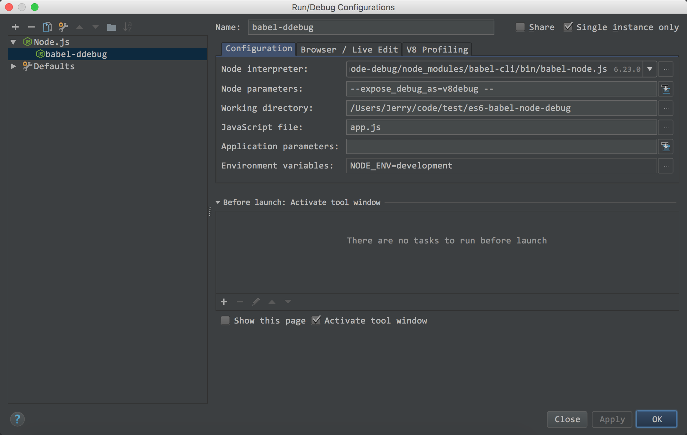
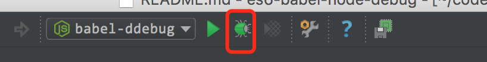
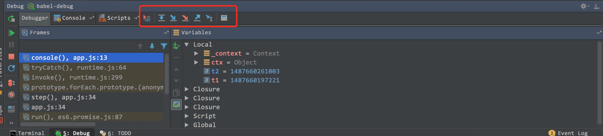

### 如何使用 webStorm 调试 babel-node 启动的服务端源代码

1. 配置启动选项示意图

2. 参数说明 & 配置后启动报错相关说明

     * Node interpreter: ./node_modules/babel-cli/bin/babel-node.js
     
     这个参数是说使用什么启动程序，默认的是 `node`, 这里我们将它设置为`babel-node`,
     可以是项目中`局部`的 babel 也可以是`全局`的babel-node,可以使用 `which babel-node`
     查看 babel-node 全局路径。

     注意如果是 `windows` 出现`CreateProcess failed with error 193 (no message available)`
     应该将其设置为 `./node_modules/bin/babel-node.cmd`,注意`npm >= 3`版本。
     
     * Node parameters: --expose_debug_as=v8debug -- //不要忽略后面的两个 --
     
     这个是对于node 的启动参数.
     
     如果出现 `v8debug is not defined` 请不要忽略 `--expose_debug_as=v8debug`。
     
     如果出现 `code.trim is not a function` 请不要忽略后面的 `--`
     
     * Working directory: 项目的路径
     
     * JavaScript file: 入口文件
     
     * Application parameters: 这个是项目中的参数, 使用`process.argv`获取。
     
     * Environment variables: 环境变量相关, 比如: `NODE_ENV=development`。

     注意这个是`key`, `value`的设置方式, 一一对应。

> 如果变量一栏里面一直出现`collecting data`, 可以将webStorm `升级到最新`, 或者使用 `node 4.x` 版本

3. 启动与调试

点击那个虫子…… 启动 debug 模式。

在`源码`打上断点，访问一下服务, 断点停住了, 可以进行调试了

下面的工具栏控制断点进度,不熟悉的可以搜下`webStorm 的调试方式`。
